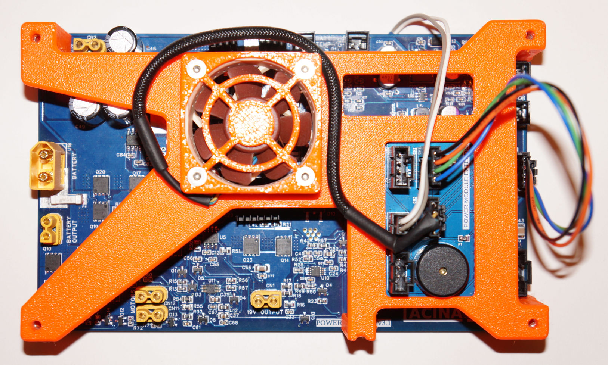

# Software for VITULUS Power Module

PlatformIO project program files for Arduino Mega embedded in VITULUS mobile robot's power module.

Power module controls 6S Li-ion battery charging, measures voltages and currents, switches on/off outputs, controls temperature in the Power unit, converts voltage to 19V for the Main unit, and more. Publishes and subscribes to ROS. Almost everything VITULUS needs to control power.

 For power module board see [Power module](https://github.com/lacina-dev/power_module).

 For power module extension board see [Power module extension](https://github.com/lacina-dev/power_module_extension).

 For more info see this doc.
 [VITULUS Power module assembly and wiring](https://docs.google.com/document/d/1gbUeb38EpmrZyLzsyhS_GtbKjz4Z-vhWeXakbzIWZlc/edit?usp=sharing)

 More about VITULUS? See my website.
 [https://lacina.dev](https://lacina.dev)

 Questions? Try Discord.
 [Discord channel](https://discord.gg/YqeNV5hEVN)

----------

Power module assembled



----------

## Hardware

- **MCU:** Arduino Mega 2560
- **Charger IC:** BQ24610 (6S Li-ion, configurable charge/precharge current via PWM)
- **Current sensing:** ADS1115 (4-channel: input, charge, discharge, 19V output)
- **Temperature:** 2x NTC thermistors (internal + external), optional DS18B20
- **Fans:** 2x PWM-controlled cooling fans with RPM feedback (tachometer via interrupt)
- **Outputs:** Battery output, motors output, 19V DC-DC output, power enable
- **Communication:** rosserial over UART @ 115200 baud

## Features

### Battery Management
- Configurable charge current (0-6A) and precharge/cut-off current (0.5-1.5A)
- Separate current setpoints for RUNNING and STANDBY module states
- Automatic charge switch control based on power supply presence
- Battery capacity estimation from voltage sampling
- Over-discharge protection (shutdown at 17.8V)
- Low battery alarm at < 5% capacity

### Power State Machine
- **STARTUP** - Initial state, all outputs off
- **RUNNING** - Robot powered on (19V output, discharge enabled)
- **STANDBY** - Low-power state (19V off, discharge enabled for module itself)

Transitions via power button (short press = standby, 2s hold = power on/off, 4s hold = full shutdown) or ROS commands.

### Sleep Management
- **Timed sleep:** Put robot to standby for a configurable interval, then wake up
- **Charge sleep:** Put robot to standby until battery is fully charged, then wake up
- **Standby timeout:** Auto-shutdown after configurable timeout when discharging and idle

### Thermal Management
- PID-controlled fans with hysteresis to prevent on/off oscillation
- Fan turns ON when temperature reaches `setpoint - 1 deg C`
- Fan turns OFF when temperature drops below `setpoint - 4 deg C`
- Minimum viable PWM (60/255) ensures fan always spins when enabled
- Independent control for internal (Fan 1) and external (Fan 2) cooling

### Thermal Protection

| State | Internal Temp | External Temp | Action |
|-------|--------------|---------------|--------|
| NORMAL | < 45 C | < 50 C | Normal operation |
| WARNING | >= 45 C | >= 50 C | Charge current reduced to 50% |
| DANGER | >= 55 C | >= 60 C | Charging stopped, alarm |
| CRITICAL | >= 65 C | >= 70 C | Emergency shutdown |

3 deg C hysteresis prevents oscillation between states.

### Fan Failure Detection
- Detects stopped fan when PWM commands spinning (RPM < 100 for 5 consecutive seconds)
- Escalates to alarm if temperature is above setpoint during failure
- Reports recovery when fan resumes

### Buzzer / Melodies
- Audible feedback for events (power on, charging, charged, alarms, low battery)
- Melody queue with buffer for up to 4 pending melodies
- Controllable via ROS topic

## ROS Interface

Communication uses [rosserial](http://wiki.ros.org/rosserial) over USB/UART at 115200 baud.

### Published Topics

| Topic | Type | Rate | Description |
|-------|------|------|-------------|
| `ups` | `vitulus_ups/vitulus_ups` | 1 Hz | Legacy UPS status (voltages, currents, capacity, status strings) |
| `power_status` | `vitulus_ups/power_status` | 2 Hz | Full module status (all measurements, switch states, setpoints, thermal/fan diagnostics) |
| `power_values` | `vitulus_ups/power_values` | 20 Hz | Fast-updating electrical values (voltages, currents, power) |

### Subscribed Topics

| Topic | Type | Description |
|-------|------|-------------|
| `set_charge_current_running` | `std_msgs/Int16` | Set charge current [mA] for RUNNING state (0-6000) |
| `set_charge_current_standby` | `std_msgs/Int16` | Set charge current [mA] for STANDBY state (0-6000) |
| `set_precharge_current_running` | `std_msgs/Int16` | Set precharge/cut-off current [mA] for RUNNING state (500-1500) |
| `set_precharge_current_standby` | `std_msgs/Int16` | Set precharge/cut-off current [mA] for STANDBY state (500-1500) |
| `set_charge_switch` | `std_msgs/Bool` | Manual charge MOSFET on/off |
| `set_discharge_switch` | `std_msgs/Bool` | Discharge MOSFET on/off |
| `set_motor_switch` | `std_msgs/Bool` | Motors output on/off |
| `set_bat_out_switch` | `std_msgs/Bool` | Battery output on/off |
| `set_19v_out_switch` | `std_msgs/Bool` | 19V DC-DC output on/off |
| `set_temp_setpoint` | `std_msgs/Float64` | Internal fan PID target temperature [deg C] (max 40) |
| `set_temp2_setpoint` | `std_msgs/Float64` | External fan PID target temperature [deg C] (max 45) |
| `set_robot_sleep` | `std_msgs/Bool` | Enable/disable timed sleep |
| `set_sleep_until_charged` | `std_msgs/Bool` | Enable/disable sleep-until-charged |
| `set_standby_timeout_discharging` | `std_msgs/UInt64` | Standby timeout [ms] |
| `set_sleep_time` | `std_msgs/UInt64` | Sleep duration [ms] |
| `set_sleep_wait_before_standby` | `std_msgs/UInt64` | Delay before standby [ms] (let robot shutdown gracefully) |
| `set_sleep_wait_charged_offset` | `std_msgs/UInt64` | Delay after charged before wake-up [ms] |
| `play_melody` | `std_msgs/Int16` | Play a melody by ID (1=beep, 2=double beep, 3=alarm, 4=horn, 5=short beep) |

### Custom Messages

- **`vitulus_ups/vitulus_ups`** - Legacy UPS message (status strings, voltages/currents as int millivolts/milliamps, capacity)
- **`vitulus_ups/power_status`** - Comprehensive status: header, voltages, currents, power for all rails, temperatures, fan RPMs, all switch states, charge/precharge setpoints, sleep status, thermal/fan debug info
- **`vitulus_ups/power_values`** - Fast electrical values: header, voltages, currents, power for input/battery/19V rails

## Pin Map

| Function | Pin | Notes |
|----------|-----|-------|
| FAN_PWM | 9 | Internal cooling fan |
| FAN2_PWM | 10 | External cooling fan |
| FAN_RPM | 2 | Fan 1 tachometer (INT0) |
| FAN2_RPM | 19 | Fan 2 tachometer (INT4) |
| ISET1_PWM | 12 | Charge current control (BQ24610) |
| ISET2_PWM | 11 | Precharge/cut-off current control |
| BATTERY_CHARGE_SWITCH | 3 | Charge MOSFET gate |
| BATTERY_DISCHARGE_SWITCH | 4 | Discharge MOSFET gate |
| OUT19V_SWITCH | 5 | 19V output MOSFET |
| OUT19V_DC_DC_EN | 6 | 19V DC-DC enable (active low) |
| TEMP_PWR | 7 | NTC power (pulsed to reduce self-heating) |
| SIGNAL_LED | 8 | Power button LED |
| POWER_EN | 31 | Main power enable |
| POWER_SWITCH_SENSE | 29 | Power button input |
| BATT_OUTPUT_SWITCH | 43 | Battery output MOSFET |
| MOTORS_OUTPUT_SWITCH | 42 | Motors output MOSFET |
| STAT_1 | 46 | BQ24610 STAT1 (charging) |
| STAT_2 | 47 | BQ24610 STAT2 (charged) |
| PG | 44 | BQ24610 Power Good |
| TEMP_NTC | A2 | Internal NTC thermistor |
| TEMP_NTC_EXT | A4 | External NTC thermistor |
| VIN_ADC | A0 | Input voltage divider |
| BATTERY_VSENSE_ADC | A1 | Battery voltage divider |
| V19_VSENSE_ADC | A3 | 19V output voltage divider |
| ONE_WIRE_BUS | 23 | DS18B20 (optional) |
| BUZZER | Timer2 | Piezo buzzer (AVR_PWM) |

## Building & Uploading

Requires [PlatformIO](https://platformio.org/).

```bash
# Build
pio run

# Upload
pio run --target upload

# Serial monitor
pio device monitor
```

## Dependencies

- OneWire (paulstoffregen/OneWire@^2.3.5)
- DallasTemperature (milesburton/DallasTemperature@^3.9.1)
- Adafruit ADS1X15 (adafruit/Adafruit ADS1X15@^2.1.1)
- AutoPID (bundled in lib/)
- AVR_PWM (bundled in lib/)
- PWM-master (bundled in lib/)
- rosserial (bundled in lib/ros_lib/)

## EEPROM Stored Parameters

The following parameters persist across power cycles:
- Charge current setpoints (running/standby)
- Precharge current setpoints (running/standby)
- Temperature setpoints (internal/external)
- Standby timeout
- Sleep time interval
- Sleep wait before standby
- Sleep wait charged offset

First boot initializes EEPROM with defaults. Subsequent boots restore saved values.

## License

See individual library licenses in `lib/` subdirectories.
